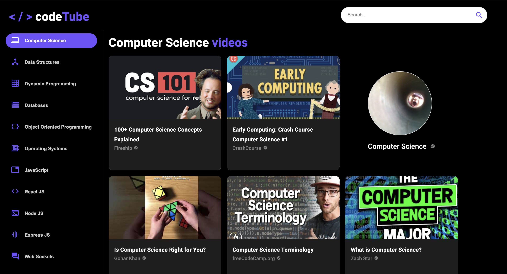
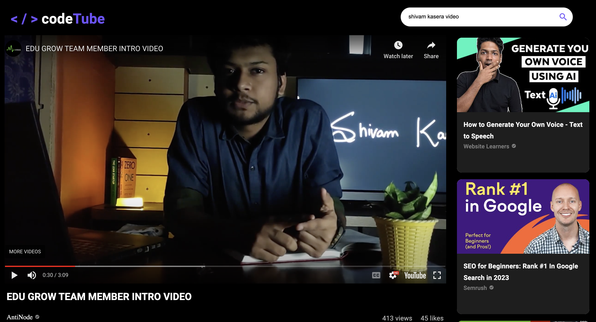
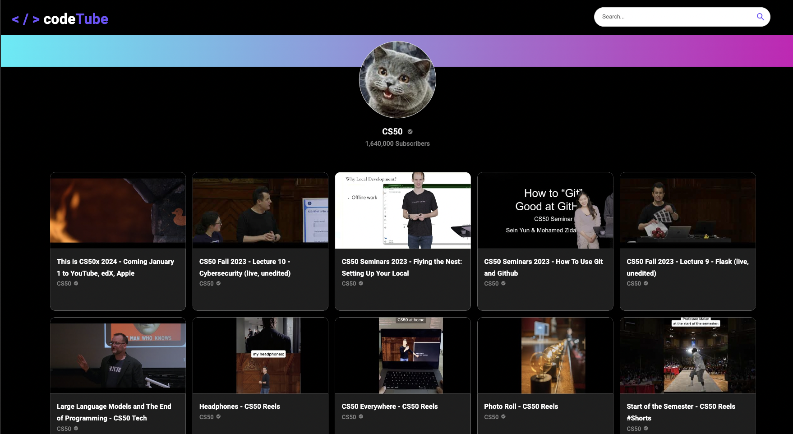

# codeTube

Introducing codeTube, the ultimate video streaming platform tailored exclusively for coding enthusiasts. Developed with React.js, codeTube goes beyond the conventional video-streaming experience to provide a distraction-free haven for developers eager to enhance their coding skills.

#### Live Link
https://genuine-caramel-b1ed1e.netlify.app/


## Tech Stack

**Tech:** HTML, CSS, Tailwind Css, JavaScript

**Library:** React Js

**Others:** Material UI, Rapid API 

  
## Install dependencies

```bash
  npm install --legacy-peer-deps
  npm start
```
 
# Features: 

### Landing Page


### Search Feed


### Video Streaming


### Channel Details



## Made By - Shivam Kasera

- [LinkedIn](https://www.linkedin.com/in/shivam-kasera-578528202/)

- [Leetcode](https://leetcode.com/shivcodes/)

- [Github](https://github.com/kaseracodes)

- [Codeforces](https://codeforces.com/profile/shivcodes.911)

- shivamkasera0951@gmail.com

  
# codeTube
